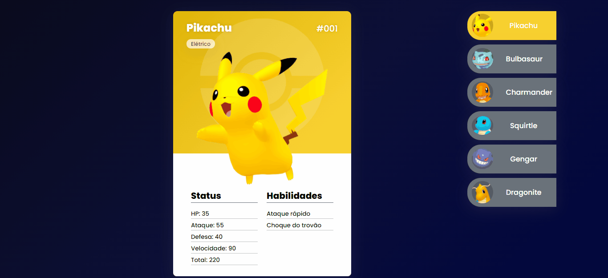
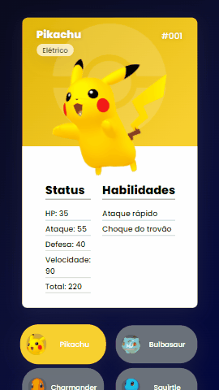

# Pokédex

Acesse o projeto <a href="https://jonathanrianelli.github.io/pokedex/">aqui</a>

## Descrição

Projeto de uma pokédex criado junto com <a href="https://www.youtube.com/c/DevemDobro">Dev em Dobro</a>

## Linguagens Usadas
- ✔️ HTML
- ✔️ CSS
- ✔️ JavaScript

## Layout 
### Desktop:

### Mobile:

 
